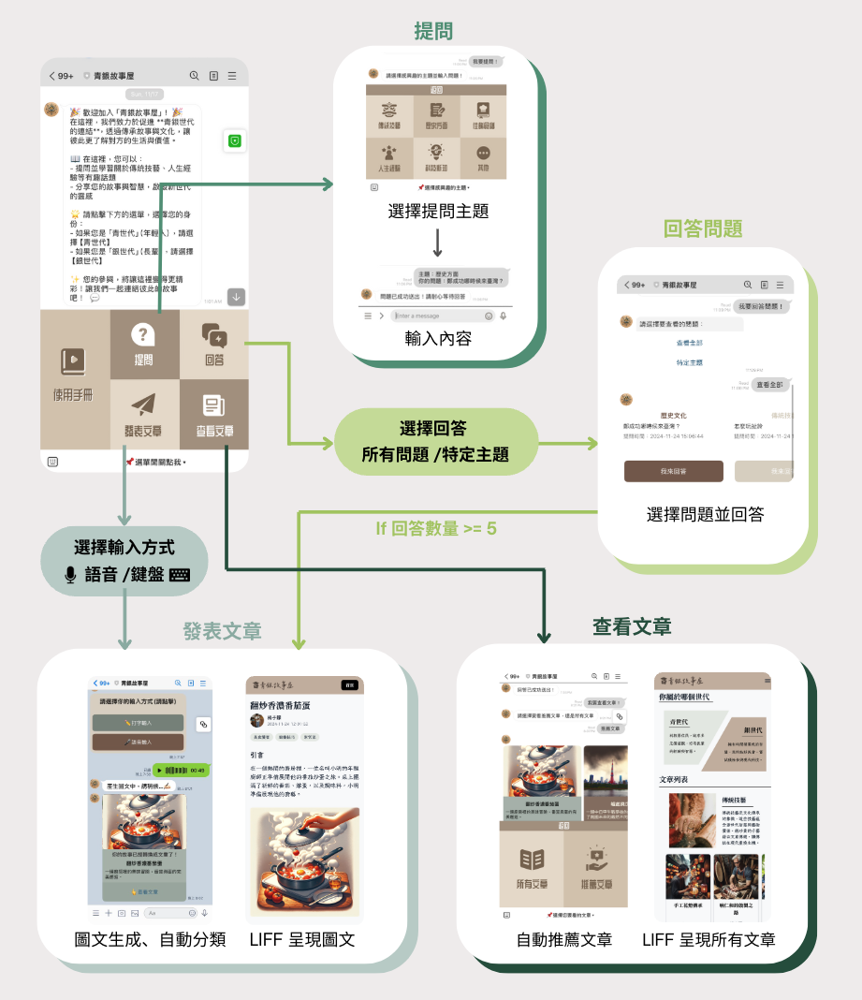
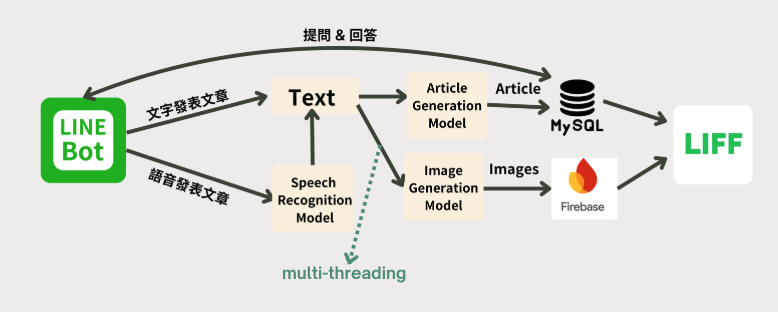

<h1 align="center">YStoryHouse</h1>
<div align="center">
  
  <h4>LINE FRESH 2024 校園競賽</h4>
</div>
<p align="center">
  <a href="#專案資訊">專案資訊</a>&nbsp;&nbsp;•&nbsp;
  <a href="#核心功能">核心功能</a>&nbsp;&nbsp;•&nbsp;
  <a href="#技術架構">技術架構</a>&nbsp;&nbsp;•&nbsp;
  <a href="#環境需求">環境需求</a>&nbsp;&nbsp;•&nbsp;
  <a href="#安裝步驟">安裝步驟</a>&nbsp;&nbsp;•&nbsp;
  <a href="#使用說明">使用說明</a>
</p>


> [!NOTE]
> <h3>青銀故事屋「一個跨世代交流的平台」。</h3>
> 
> 社交是人類不可或缺的需求，在如今社群爆炸的時代，卻沒有一款適合銀髮族分享的平台，因為複雜的社群平台入門往往不易，銀世代常難以上手，然而他們積累的知識卻是不可或缺的結晶，因此我們以 LINE 這個「銀世代最熟悉的APP」為主要媒介，結合語音辨識與生成式 AI，讓青銀故事屋成為跨世代最流行的社交平台。透過圖文生成與問答互動，青銀兩世代可以分享知識，甚至互相提問，縮短世代隔閡的同時實踐價值延續。
> 
> 專案不僅滿足青銀兩代的需求，還具備深遠的社會與經濟效益。透過知識分享與文化交流，提升銀世代的自我價值，同時激發青世代的解決問題能力。結合回饋機制促進平台參與度，帶動商業活動，實現社會共好與經濟正循環。

## 專案資訊
> [!Tip]
> - [Demo 影片](https://www.youtube.com/watch?v=QEzR6sx1SfAo)
> - [Project 企劃書](https://www.canva.com/design/DAGXStSQ2DY/urVT4kM-0JidpO_EJJMkOw/edit?utm_content=DAGXStSQ2DY&utm_campaign=designshare&utm_medium=link2&utm_source=sharebutton)

## 參賽資訊
| 姓名 | 學校 |
| --- | --- |
| 邱振源 | 交大資工大三 |
| 朱驛庭 | 交大資工大三 |
| 楊子賝 | 交大資工大三 |
| 陳冠智 | 交大資工大三 |
| 蔡昀錚 | 交大資工大三 |
### Contributors
<a href="https://github.com/ChuEating1005/LINE-FRESH-2024/graphs/contributors">
  
</a>

## 核心功能
<div align="center">
     
</div>  

平台提供以下特色功能：
- **語音輸入**：讓銀髮族輕鬆分享故事
- **智慧整合**：運用 AI 技術將對話轉化為精彩文章
- **故事插圖**：自動生成故事段落畫面圖片，增強閱讀體驗
- **互動問答**：促進世代間知識交流
- **分類瀏覽**：輕鬆找到感興趣的主題


## 技術架構
<div align="center">
  
</div>  

- **前端**：LINE Frontend Framework (LIFF)
- **後端**：Django
- **資料庫**：MySQL
- **LLM**：ChatGPT 3.5-Turbo / 4o (OpenAI API)
- **圖片生成**：Pollinations.ai API / DALL-E 3 (OpenAI API)
- **訊息服務**：LINE Messaging API
- **語音處理**：Taiwan AI Labs ASR （雅婷智慧）
- **容器化**：Docker

## 環境需求
> [!Caution]
> **以下為本專案所需之環境，請確保這些環境已成功建置**
> - Python 3.x
> - Docker
> - LINE Messaging API
> - LIFF ID
> - Firebase Storage
> - OpenAI API 金鑰
> 
> 詳請可至 [env.example](./backend/.env.example) 確認需要哪些屬性

## 安裝步驟

1. **複製專案：**

   ```bash
   git clone https://github.com/ChuEating1005/2024-LINE-FRESH.git
   cd 2024-LINE-FRESH/backend
   ```

2. **建立環境變數檔案：**

   複製 `.env.example` 模板並建立 `.env` 檔案，填入對應欄位資訊：

   ```bash
   cp .env.example .env
   ```

3. **Pull MySQL Docker Image**

   ```bash
   docker pull mysql:8.0
   ```

4. **安裝語音處理必要套件：**

   For MacOS:
   ```bash
   brew install portaudio
   brew install ffmpeg
   ```

   For Ubuntu:
   ```bash
   sudo apt-get update
   sudo apt-get install portaudio19-dev python3-pyaudio ffmpeg
   ```

5. **安裝 Python dependencies:**

   ```bash
   pip install -r requirements.txt
   ```

6. **啟動專案：**

   ```bash
   cd backend
   python3 set_richmenu.py  # 設置 LINE Bot 選單
   make start              # 啟動服務
   ```

## 使用說明

### 管理介面
- Access the Django admin interface at `http://localhost:8000/admin/`
- The bot's callback URL is (LINE Bot Endpoint) `http://localhost:8000/bot/callback/`
- Article list (LIFF Endpoint): `http://localhost:8000/bot/article/`

### LINE Bot 功能
1. **發表文章**
   - 支援文字輸入
   - 支援語音輸入（自動轉換為文字）

2. **回答問題**
   - 查看待回答的問題
   - 提供答案（支援文字/語音）
   - 系統自動整合多人回答生成文章

3. **提出問題**
   - 提出一個問題
   - 在問題被5人以上回答之後，將生成的文章推給使用者。

3. **瀏覽文章**
   - 依分類瀏覽
   - 點讚功能
   - 相關文章推薦

## 專案結構

```
backend/
└── bot/                # LINE Bot 主要應用
    ├── handlers/      # 訊息處理邏輯
    ├── models/        # 資料模型
    ├── templates/     # 網頁模板
    ├── views/         # 視圖函數
    └── templates/     # 共用模板
```

## License

This project is licensed under the MIT License - see the [LICENSE](LICENSE) file for details.
